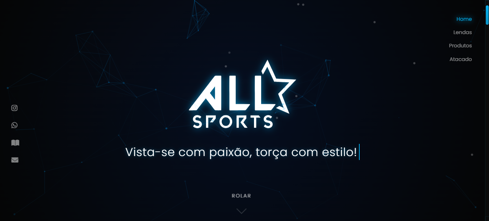

# 🏀 AllStar Sports

[](https://opensource.org/licenses/MIT)
[](https://developer.mozilla.org/en-US/docs/Web/HTML)
[](https://developer.mozilla.org/en-US/docs/Web/CSS)
[](https://developer.mozilla.org/en-US/docs/Web/JavaScript)
[](https://www.w3.org/TR/css3-mediaqueries/)
[](https://michalsnik.github.io/aos/)
[](https://vincentgarreau.com/particles.js/)
[](https://github.com/ismapereira)
[](https://github.com/ismapereira)

<div align="center">
  
</div>

## 📋 Sobre o Projeto

A AllStar Sports Store é uma loja online especializada em artigos esportivos, com foco em camisas oficiais de basquete e futebol. O site foi desenvolvido com as melhores práticas de design e desenvolvimento web, oferecendo uma experiência de usuário excepcional.

> 🌟 **Missão**: Proporcionar aos amantes do esporte uma experiência de compra única, combinando design moderno, performance e usabilidade.

### ✨ Características Principais

- 🎯 Design responsivo e moderno
- 🌟 Animações suaves e interativas
- 🏃 Performance otimizada
- 📱 Compatível com todos os dispositivos
- 🎨 Interface intuitiva e atraente
- 🔒 Código limpo e bem documentado
- 🚀 Carregamento rápido e otimizado
- 💫 Efeitos visuais modernos

## 🚀 Tecnologias Utilizadas

- **HTML5** - Estruturação semântica
  - SEO otimizado
  - Acessibilidade (ARIA)
  - Microdata implementado
- **CSS3** - Estilização moderna com:
  - Flexbox
  - Grid
  - Animações
  - Variáveis CSS
  - Media Queries
  - Pseudo-elementos
  - Transformações 3D
- **JavaScript** - Interatividade e funcionalidades
  - ES6+ features
  - Promises e Async/Await
  - Manipulação DOM otimizada
  - Event Delegation
- **AOS (Animate on Scroll)** - Animações de scroll
- **Google Fonts** - Tipografia personalizada
- **Particles.js** - Efeitos de partículas
- **Font Awesome** - Ícones vetoriais

## 🎯 Seções do Site

### 🏠 Home
- Hero section com animação de parallax
- Menu de navegação flutuante
- Links para redes sociais
- Efeito de partículas interativo
- Cursor personalizado
- Slogan com efeito typewriter

### 🏆 Lendas do Esporte
- Cards informativos
- Efeitos de hover elegantes
- Categorias por modalidade
- Animações suaves
- Efeito tilt nos cards
- Imagens otimizadas

### 🛍️ Produtos
- Grid responsivo de produtos
- Cards interativos
- Informações detalhadas
- Sistema de tamanhos
- Botão de catálogo completo
- Hover effects modernos
- Sistema de preços dinâmico

### 📞 Contato
- Formulário de contato
- Tabela de preços para atacado
- Informações de contato
- Validação em tempo real
- Feedback visual
- Mensagens de sucesso/erro

## 💻 Como Executar

1. Clone o repositório
```bash
git clone https://github.com/seu-usuario/allstar-sports-store.git
```

2. Navegue até o diretório
```bash
cd allstar-sports-store
```

3. Abra o arquivo index.html no seu navegador
```bash
start index.html
```

> 💡 **Dica**: Para melhor experiência de desenvolvimento, use o Live Server do VSCode

## 📱 Responsividade

O site é totalmente responsivo e se adapta aos seguintes dispositivos:

- 📱 Smartphones (320px+)
  - Layout otimizado
  - Touch-friendly
  - Fast loading
- 📱 Tablets (768px+)
  - Interface adaptativa
  - Gestos touch
  - Orientação dupla
- 💻 Laptops (1024px+)
  - Experiência completa
  - Hover effects
  - Performance máxima
- 🖥️ Desktops (1200px+)
  - Alta resolução
  - Animações completas
  - Máximo de recursos

## ⚡ Performance

- Imagens otimizadas
  - Formato WebP
  - Lazy loading
  - Compressão inteligente
- CSS minificado
  - Critical CSS
  - Code splitting
- JavaScript modular
  - Tree shaking
  - Code splitting
  - Minificação
- Carregamento assíncrono
  - Scripts defer
  - Preload crítico
- Cache eficiente
  - Service Worker
  - Cache strategies
  - Offline first

## 🎨 Paleta de Cores

-  `#00AFEF` - Cor Primária
  > Energia e modernidade
-  `#001E5A` - Cor Secundária
  > Profissionalismo e confiança
-  `#FFFFFF` - Branco
  > Clareza e simplicidade
-  `#0A0A0A` - Escuro
  > Elegância e sofisticação
-  `#050505` - Mais Escuro
  > Profundidade e contraste

## 📝 Licença

Este projeto está sob a licença MIT. Veja o arquivo [LICENSE](LICENSE) para mais detalhes.

## 🤝 Contribuição

Contribuições são sempre bem-vindas! Por favor, leia as [diretrizes de contribuição](CONTRIBUTING.md) primeiro.

### Como Contribuir
1. Fork o projeto
2. Crie sua Feature Branch (`git checkout -b feature/AmazingFeature`)
3. Commit suas mudanças (`git commit -m 'Add some AmazingFeature'`)
4. Push para a Branch (`git push origin feature/AmazingFeature`)
5. Abra um Pull Request

## 👨‍💻 Autor

Feito com ❤️ por [Ismael](https://github.com/ismapereira)

<div align="center">

[](https://www.linkedin.com/in/ismael-pereira-feitosa-ba2aa91a9/)
[](https://github.com/ismapereira)
[](https://ismapereira.github.io/Portifolio-Ismael-Pereira/)
[](mailto:ismaelpereirafeitosa@hotmail.com)

</div>

---

<div align="center">


[](https://github.com/ismapereira/AllStar-Sports---Novo-Site)
[](https://github.com/ismapereira/AllStar-Sports---Novo-Site)
[](https://github.com/ismapereira/AllStar-Sports---Novo-Site/stargazers)
[](https://github.com/ismapereira/AllStar-Sports---Novo-Site/network/members)
[](https://github.com/ismapereira/AllStar-Sports---Novo-Site/issues)
[](https://allstarsports.vercel.app/)
[](https://github.com/ismapereira)

</div>
